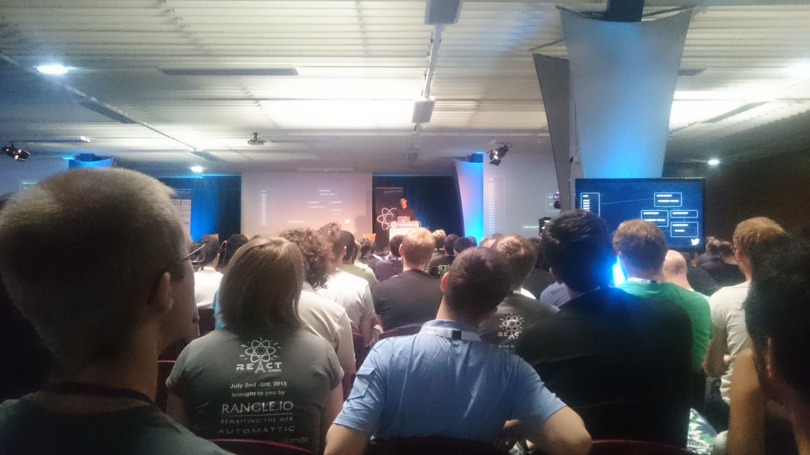
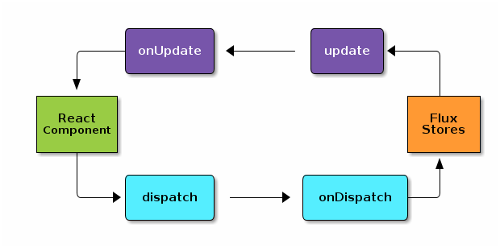

# Intro

Zenika était à l'espace Charenton à Paris le mois dernier pour la deuxième conférence sur React après la ReactJS.conf en janvier : React-europe. Une partie de la core team React (mais aussi Relay / GraphQL) était présente pour nous parler des nouveautés des 6 derniers mois ainsi que des directions prises pour le futur.

## TL:DR;
Deux notions sont revenues dans beaucoup de talks et ont donné l'esprit général du contenu de la conférence :
- La DX (Developer eXperience): aussi importante que l'UX (User eXperience), elle est au coeur des librairies de l'écosytème React. Le futur des animations en React par exemple est tourné vers la DX.
- React doit être vu comme un principe, une philosophie. Le React actuel est une implémentation (DOM), React Native en est une autre (iOS). Ce détachement était un thème récurrent: React dans le canvas, React comme aggrégateur de données coté serveur, React dans le terminal (WTF ?),... Sebastian Markbage allant même jusqu'à présenter une charge contre le DOM qu'il présente comme un boulet accroché au pied de React. Ce détachement est d'ailleurs la nouveauté de la version 0.14 dont la beta a été annoncée dans un [blog post](https://facebook.github.io/react/blog/2015/07/03/react-v0.14-beta-1.html) durant la conférence.

# Keynote

La keynote était présentée par Christopher Chedeau (@vjeux), le *frenchie* de la team React, qui était également le chef d'orchestre de la conférence. Il a comparé l'évolution de l'écosystème React à la méthode du [recuit simulé](https://fr.wikipedia.org/wiki/Recuit_simul%C3%A9), un procédé industriel s'appuyant sur un refroidissement maîtrisé d'un matériau transitant petit à petit d'un état instable où les atomes fusent dans tous les sens vers un état stable où les molécules se forment et s'ordonnent pour former un matériau solide et fiable. React est dans cet état transitoire : certains concepts ont évolué, d'autres ont disparu, d'autres encore sont devenus incontournables (immutabilité, compilation avec Babel, build avec Webpack + react-hot-loader) : d'après Christopher, nous tendons de plus en plus vers un écosystème stable et performant, le React de demain.

Le sujet React-Native a été abordé pour illustrer le fait que les principes de React peuvent être appliqués dans différentes situations (le fameux "Learn Once, Write Everywhere"). En guise d'exemple, Christopher a évoqué un portage d'une app mobile React-Native iOS vers Android où **87%** du code a pu être réutilisé en un temps record alors que la team n'avait pas de compétence particulière en développement Android !

Pour conclure la keynote, Christopher nous assure que l'empreinte de Facebook est de plus en plus réduite, les contributeurs open-source sont plus que jamais les bienvenus, en s'osant même un brin moralisateur sur la "concurrence malsaine" introduite par les différentes communautés (Angular, Ember, Backbone, ...). Le mot d'ordre est "Aimez vous les uns les autres" et "Do not feed the troll" !

- Vidéo : https://www.youtube.com/watch?v=PAA9O4E1IM4
- Twitter : https://twitter.com/vjeux

# Inline styles

Comme abordé dans un précédent article, les CSS sont un peu le parent pauvre des applications React. Le JSX impose de mixer la logique impérative de la page avec sa structure HTML, améliorant ainsi la DX (plus besoin de naviguer sans cesse entre le template et le script !). Faire la même chose en CSS revient finalement à faire du style "inline" dans le composant, mais le cap est alors plus difficile à franchir. Michael Chan (@chantastic) nous explique là le bienfondé de cette pratique, mais surtout les incongruïtés de l'état de l'art ("bullshit", a t'on cru entendre !).

## Style is not CSS

Par abus de langage, "les styles" et "la CSS" désignent la même chose, mais n'oublions pas que la CSS n'est qu'une façon de déclarer les styles de notre application. A l'origine, les styles étaient déclarés dans l'attribut `style`, avec les problèmes de duplication et de lisibilité que l'on connait. Les sélecteurs CSS et le web sémantique (balises h1, h2, p, ul, li, ...) ont permis l'externalisation des styles dans une CSS. Michael souligne qu'avec `h1 {font-weight: bold;}` d'un coté ou `<div class="menu">...</div>` de l'autre, le HTML et le CSS sont déjà intimement liés.

## State changes are UI changes

Le principe de la responsabilité unique ([SoC](https://en.wikipedia.org/wiki/Separation_of_concerns)) déjà mis à mal, c'est encore pire lorsqu'on ajoute du comportement en JS. La logique ainsi implémentée vise en général à modifier "l'état" de notre composant : modification du markup, hide / show sur certains éléments, utilisation de classes *isSelected*, *isEmpty*, ... Le HTML, le CSS et le JS sont au service de l'état du composant.

En faisant maintenant le parallèle avec React, où l'état du composant est central et définit entièrement le rendu, il devient naturel que c'est cet état qui doit porter les styles.

## Mise en pratique

Après avoir exposé le bien-fondé de cette pratique, Michael enfonce le clou avec quelques exemples de mise en oeuvre. La transformation CSS vers style-inline est aisé, le code du composant s'en trouve modérement étoffé. L'utilisation de variables est possible sans passer par LESS / SASS. Ces variables peuvent être externalisées dans un module CommonJS qui peut être subtitué par un autre (équivalent des thèmes CSS).

Les pseudo-classes n'ont pas d'équivalent en "style inline", il faut alors traiter au cas par cas. Parfois c'est facile (on peut reproduire `:nth-child()` avec la variable d'itération lors du rendu d'une liste par exemple), parfois la question ne se pose même pas (`:before` et `:after` deviennent... un span placé avant ou après l'élément), parfois c'est compliqué : le `:hover` est transformé en écoute d'événement mouseover et mouseout nettement plus verbeuse !

C'est là que des librairies comme [Radium](https://github.com/FormidableLabs/radium) permettent de s'affranchir de ces problèmes en interprétant les pseudo-classes et les media-queries (autre point noir des styles inline) définies dans une collection JS:
```javascript
var style = {
  width: '25%',

  '@media (min-width: 320px)': {
    width: '100%',

    ':hover': {
      background: 'white'
    }
  }
};
```

## Ma conclusion
Déjà peu attiré par le CSS, je n'ai eu aucun mal à adhérer aux théories de Michael. On sent que la question des CSS pour les composants React est épineuse et donne lieu à des tas de work-arounds (comme pour [react-modal](https://github.com/rackt/react-modal/blob/master/lib/helpers/injectCSS.js) par exemple).
Bien décidé à tester Radium, j'espère retrouver le même confort que lors de ma découverte du JSX (l'aspect "mono-fichier"). J'ajouterai un avantage que n'a pas cité Michael : le style inline sonne le glas du code mort difficilement détectable des CSS.

- Vidéo : https://www.youtube.com/watch?v=ERB1TJBn32c
- Twitter : https://twitter.com/chantastic
- Slides : https://speakerdeck.com/chantastic/inline-styles-react-europe



# Flux over the wire

La transposition des principes de React à différents supports (mobile, canvas, etc.) est valable également pour Flux. Elie Rotenberg, CTO de jeuxvideo.com, a présenté une utilisation de Flux partagée entre le client et le serveur.

## Symetrical Flux

Elie introduit les notions de Flux, où le store est garant de l'état de l'appli (unique source de vérité) et les composants accèdent à cet état: l'état est partagé mais maintenable car centralisé dans le store. L'idée à la base de l'approche particulière d'Elie, c'est que les actions soumettant un résultat via le dispatcher et les stores émettant des notifications aux composants sont 2 actes similaires dans leur principe : il s'agit dans les 2 cas d'un échange unilatéral entre 2 briques du modèle Flux. Le modèle Flux peut alors être vu comme un modèle symétrique ("symetrical flux") où les composants dispatchent les données des stores et les stores notifient les composants en retour:



## Flux over the channel

Cette simplification du modèle Flux (les actions ont disparu, la notification des stores n'est plus une simple notification mais contient des données) permet de localiser les stores coté serveur et les composants coté client. Ils peuvent communiquer quelque soit l'implémentation:
- Callbacks / promesses
- Event emitters
- Websockets
- Webworkers
- etc.

Ce modèle peut s'appliquer par exemple à un tchat. Le store contient l'état de la salle de tchat, il est partagé et accessible par les composants conformément au modèle Flux... à ceci près que les composants se trouvent sur des clients différents (desktop ou mobile) !

## Nexus Flux

Ce principe de "Flux sur le réseau" est en place sur les sites majeurs de Webedia gaming (jeuxvideos.com, millenium.org). Un bon nombre de librairies sont disponibles sur le [compte Github d'Elie](https://github.com/elierotenberg). Parmi elles, *Nexus Flux* est l'implémentation "symetrical Flux" qui abstrait les méthodes dispatch et onChange, laissant la main aux adaptateurs tels que *Nexus Flux Socket.io*. D'autres adaptateurs vont pouvoir être créés dans le futur pour les différents moyens de communication client / serveur susmentionnés.

Nexus Flux a aussi pour rôle d'optimiser les souscriptions aux stores coté serveur. Lorsqu'un composant souscrit aux notifications d'un store, il lance fatalement une requête HTTP aux stores coté serveur. Nexus Flux introduit une brique au milieu de la communication composants / stores chargée de gérer et d'optimiser les souscriptions (mode "batch", avec plusieurs souscriptions en 1 requête).

## Ma conclusion
Ici c'est Flux qui est adapté dans un autre contexte : les échanges client / serveur. Le pattern est bien respecté au final. En revanche, ca reste réservé à un besoin de "statefulness" important coté serveur, comme les fonctionnalités sociales de Webedia (tchat, live vidéo, ...).

- Vidéo : https://www.youtube.com/watch?v=JSjhhUvB9DY
- Twitter : https://twitter.com/elierotenberg
- Slides : https://speakerdeck.com/elierotenberg/flux-over-the-wire-at-reacteurope-2015

# Exploring GraphQL

Dévoilé au public en janvier dernier à la React.conf, GraphQL est une API de requêtage utilisée par Facebook. Lee Byron a présenté en détail les fonctionnalités ainsi que les travaux effectués pour rendre la librairie utilisable dans un autre contexte que Facebook. Il a d'ailleurs annoncé la sortie publique du premier draft de la [spécification](http://facebook.github.io/graphql/), ainsi que la première [implémentation](https://github.com/graphql/graphql-js) pour NodeJS.

## Mental model

A l'époque, la première application Facebook mobile était une encapsulation du site Web, réutilisant donc les API serveur de ce dernier. Lorsque les applications Facebook sont devenues des applications natives, les problèmes de maintenance coté serveur ont commencé à apparaître. Comment maintenir plusieurs endpoints coté serveur pour les différents clients Facebook ?

La norme REST facilite les échanges mais a ses défauts, notamment la nécessité d'envoyer plusieurs requêtes pour récupérer des sous-entités. Une première réponse à ce problème a été [FQL](https://developers.facebook.com/docs/technical-guides/fql/), sorte de SQL enrichi avec des noms de "table" customisés. Mais son utilisation restait difficile à cause d'une manière non naturelle de récupérer les données (jointures compliquées).

Ainsi est né GraphQL qui permet de déclarer nos requêtes sous forme de graphe, tel que nous les pensons : on parle de **mental model**. Une requête GraphQL se présente comme suit:
```javascript
{
  user(id: 29550) {
    name
    country
    colleagues(attendTo: 'ReactEurope2015') {
      name
    }
  }
}
```

La requête ressemble à une structure JSON sans les valeurs, uniquement les clés (appelées "champs"). Ces champs peuvent prendre des arguments (ici : id du `user` égal à 29550).

La réponse sera de la forme:
```javascript
{
  user: {
    name: 'Nicolas Cuillery'
    country: 'France'
    colleagues : [
      {name: 'Matthieu Lux'},
      {name: 'Florent Lepretre'},
      {name: 'Ahmad Cousin'}
    ]
  }
}
```
La réponse est en JSON valide cette fois et contient uniquement les champs demandés. Avec cet exemple, on voit la facilité avec laquelle on requête les données (cela revient à écrire un DTO) et avec laquelle on réalise nos "projections".

## Architecture

Ce qu'il faut bien voir, c'est que GraphQL n'est pas un système de stockage et peut donc être utilisé par dessus n'importe quelle source de données. Le rôle du serveur GraphQL est de fournir des "possibilités" (l'équivalent des champs, ou groupes de champs), c'est aux clients de dire quelles possibilités ils veulent (c'est à dire une requête GraphQL).

C'est particulièrement intéressant pour les applications mobile de Facebook qui changent de version à rythme régulier et dont le paysage est très fragmenté : de nombreuses versions de chaque apps sont utilisées en même temps, avec des requêtes différentes d'un version à l'autre (un champ en plus par exemple). C'est le client qui contient la requête, le serveur se contente d'exposer des possibilités. Facebook maintient ainsi aisément les requêtes envoyées par des utilisateurs qui n'ont pas mis à jour leur application depuis plus d'un an !

## Typage & introspection

Toutes les possibilités sont décrites précisement par un schéma, par exemple, pour le `user` vu précédemment:
```
type User {
  name: String,
  country: String,
  events: [String]
  colleagues(attendTo: String = '*'): [User]
}
```

Nativement, un serveur GraphQL expose ce schéma aux clients, ouvrant ainsi la porte à une quantité d'outils pour le développeur:
- Validation
- Intégration avec les IDE
- Documentation automatique de l'API
- Génération de code

## Backed by your code

Il n'y a rien de magique dans la récupération des données, GraphQL attend une méthode pour chaque champ dont les arguments deviennent logiquement des paramètres de la méthode. C'est là qu'on va appeler les couches inférieures de notre application pour remonter / aggréger les données. Exemple en JS pour le user ci-dessous:
```javascript
{
  name: function(user) {
    return user.name;
  },
  country: function(user) {
    return user.country;
  },
  colleagues: function(user, attendTo) {
    if(attendTo === '*') {
      return userService.getAllColleagues(user.id);
    } else {
      return userService.getColleaguesByEventName(user.id, attendTo);
    }
  }
}
```

Le base de code existante peut donc être réutilisée pour fournir une API GraphQL.

## Ma conclusion

La présentation (totalement détachée de React) présente clairement où se place GraphQL. La récupération entité après entité, champ après champ, me laisse penser que l'adaptation est plus aisée sur une architecture micro-service. Le buzz autour de la technologie laisse supposer qu'on pourra voir de belles choses autour de GraphQL dans le monde JS, comme par exemple une intégration avec Mongoose (qui apporte un système de schéma totalement équivalent). Seul regret concernant l'écriture, Lee a brièvement évoqué des **mutations** inspirées des actions Flux, j'aurai aimé en voir un peu plus.

- Vidéo : https://www.youtube.com/watch?v=WQLzZf34FJ8
- Twitter : https://twitter.com/leeb
